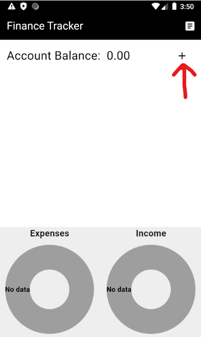
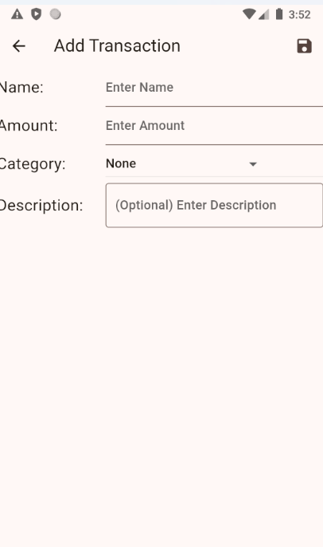
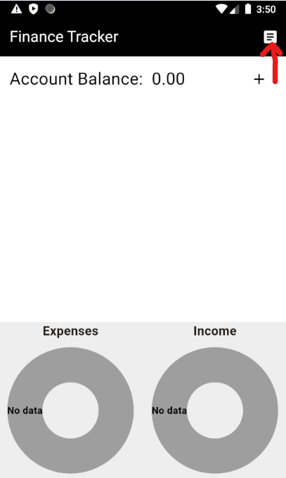
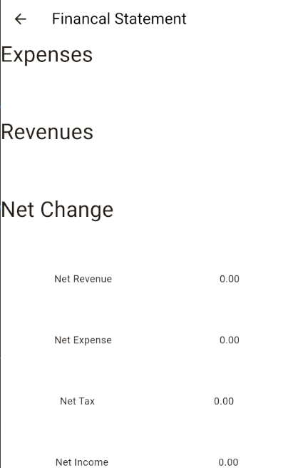
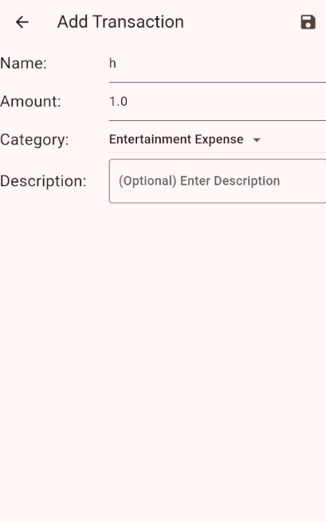
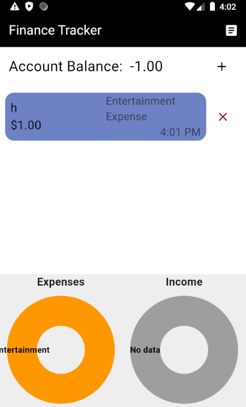
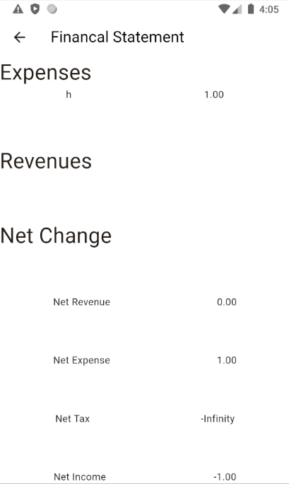
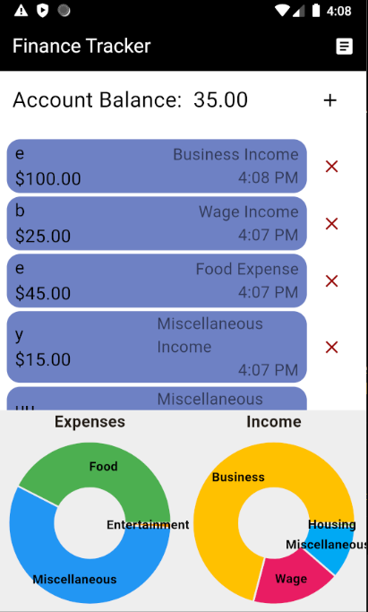
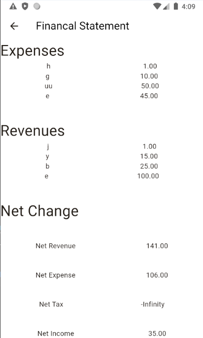

# final_project

## Name
Finance Tracker

## Description
Allow you to add transactions to an account and make a financial simple statement with them. This app is free and rather simple and initutive.

## Visuals

## Installation
Clone it using git clone and this is using dart programming language.

## Usage
Use examples liberally, and show the expected output if you can. It's helpful to have inline the smallest example of usage that you can demonstrate, while providing links to more sophisticated examples if they are too long to reasonably include in the README.
 results in  and 
Adding a ton of transactions results in  and 

## Authors and acknowledgment
Thanks to Zack Crouse, Huakun Xu, Arda Egrioglu, and Tung Thanh Hoang for their contribution to this project.